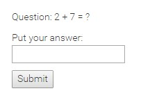

# laravel-5 Captcha
This is very simple and lightweight mathematical captcha class. You can easily configure it in your laravel 5 project.

# Documentation
1. First download the **Mc.php** file and put this file in your **App/Http/Controllers** directory
2. Now in your controller method implement like as
  
  ```PHP
  public function index()
	{
		Mc::putMcData();
		$question=Mc::getMcQuestion();
		return view('test',compact('question'));
	}
  ```
3. In your view
  
  ```HTML
	<p>Question: {{$question}}</p>
	<form action="{{route('postTestRoute')}}" method="POST">
		<input type="hidden" name="_token" value="{{ csrf_token() }}">
		<p>Put your answer: <input type="text" name="answer"></p>
		<input type="submit">
 	</form>
     
  ```

	
4. Now check the given captcha is right or wrong in your controller method.
	  
 ```PHP
	public function postMc()
	{
		$answer=Input::get('answer');
		if($answer==Mc::getMcAnswer())
		{
			return "Correct answer";
		}
		else
		{
			return "Incorrect";
		}
	}
  ```
